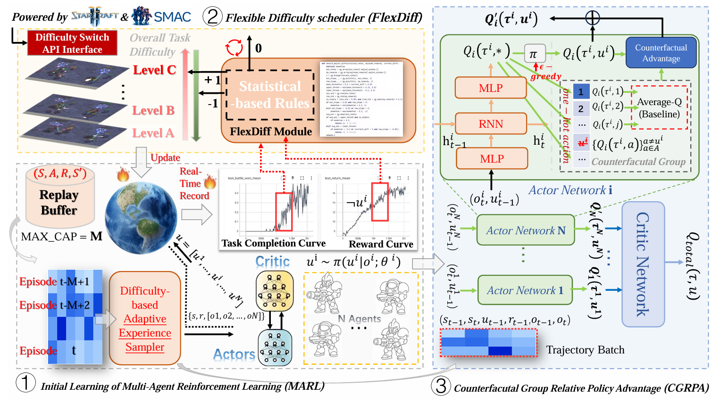
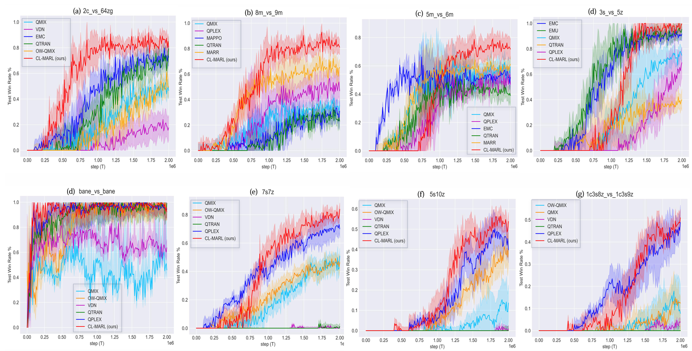

# CL-MARL: Dynamic Curriculum Learning with Counterfactual Group Relative Policy Advantage for MARL (StarCraft II)

[](https://opensource.org/licenses/MIT)
[](https://www.python.org/downloads/)
[](https://pytorch.org/)

Official implementation of Anonymous authors' under-review MARL paper:  
**"Curriculum Learning With Counterfactual Group Relative Policy Advantage For Multi-Agent Reinforcement Learning"**

[[Paper]](https://arxiv.org/abs/) | [[Project Page]](https://github.com/SmileHappyEveryDay/CL-MARL) | [[SMAC Benchmark]](https://github.com/oxwhirl/smac)

[//]: # (XXXX.XXXXX)

---

## 🚀 Key Features
- **FlexDiff**: Adaptive difficulty scheduler for dynamic curriculum learning in MARL  
- **CGRPA**: Novel credit assignment combining counterfactual reasoning with group policy optimization  
- **Plug-and-play** compatibility with AC framework-based MARL algorithms, like QMIX, and VDN  
- **State-of-the-art performance** on StarCraft II Micromanagement (SMAC) benchmark  

<p align="center">
  
</p>

---

## 📌 Installation

1. **Clone the repository**:
   ```bash
   git clone https://github.com/SmileHappyEveryDay/CL-MARL.git
   cd CL2MARL-SMAC

## Requirements
Use `pip install -r requirements.txt` to install the following requirements:

- numpy
- torch-cuda
- [SMAC](https://github.com/oxwhirl/smac)
- [pysc2](https://github.com/deepmind/pysc2)

## Acknowledgement
- [MARL implementation by GitHub: starry-sky6688](https://github.com/starry-sky6688/MARL-Algorithms)
+ [SMAC](https://github.com/oxwhirl/smac)
+ [pymarl](https://github.com/oxwhirl/pymarl)


## Quick Start

```shell
$ CUDA_VISIBLE_DEVICES=0 nohup /home/%your_name%/%your_anaconda_path/envs/sc2/bin/python3 -u /home/%your_name%/%path_to_this_project%/CL2MARL-SMAC/main.py --map=5m_vs_6m --alg=currilen_advantage_qmix --flexdiffways="flexible" --n_steps=2000000 --total_test_number=1 --cuda=True > CLQMIX-5m_vs_6m-200w.log &
```

***
### 📌 Part of the recorded performance.

<p align="center">
  
</p>

This project is forked from [starry-sky6688/MARL-Algorithms](https://github.com/starry-sky6688/MARL-Algorithms), which also included Pytorch implementations of other multi-agent reinforcement learning algorithms, including 
[IQL](https://arxiv.org/abs/1511.08779),
[QMIX](https://arxiv.org/abs/1803.11485), [VDN](https://arxiv.org/abs/1706.05296), 
[COMA](https://arxiv.org/abs/1705.08926), [QTRAN](https://arxiv.org/abs/1905.05408)(both **QTRAN-base** and **QTRAN-alt**),
[MAVEN](https://arxiv.org/abs/1910.07483), [CommNet](https://arxiv.org/abs/1605.07736), 
[DyMA-CL](https://arxiv.org/abs/1909.02790?context=cs.MA), and [G2ANet](https://arxiv.org/abs/1911.10715), 
which are the state of the art MARL algorithms tested on [SMAC](https://github.com/oxwhirl/smac), the decentralised micromanagement scenario of [StarCraft II](https://en.wikipedia.org/wiki/StarCraft_II:_Wings_of_Liberty).

## Creating New Curriculum
If you wanna explore more funny for curriculum learning, please modify `runner.py` to:

- Add new difficulty metrics
- Implement custom scheduling logic

🤝 **Contributing**  
We welcome contributions! Please open an issue or submit a pull request for:

- Bug fixes
- New SMAC scenarios
- Algorithm extensions

📧 **Contact**  
For questions, please contact:

- Anonymous: anonymous@anonymous.anonymous
- Project maintainer: anonymous

📜 **Citation**  
If you use this work in your research, please cite:

```bibtex
@article{anonymous2025counterfactual,
  title={Counterfactual Group Relative Policy Advantage Empowered Dynamic Curriculum Learning for Multi-Agent Reinforcement Learning},
  author={anonymous et al.},
  journal={anonymous},
  year={2025}
}
```

[//]: # (IEEE Transactions on Anonymous)
